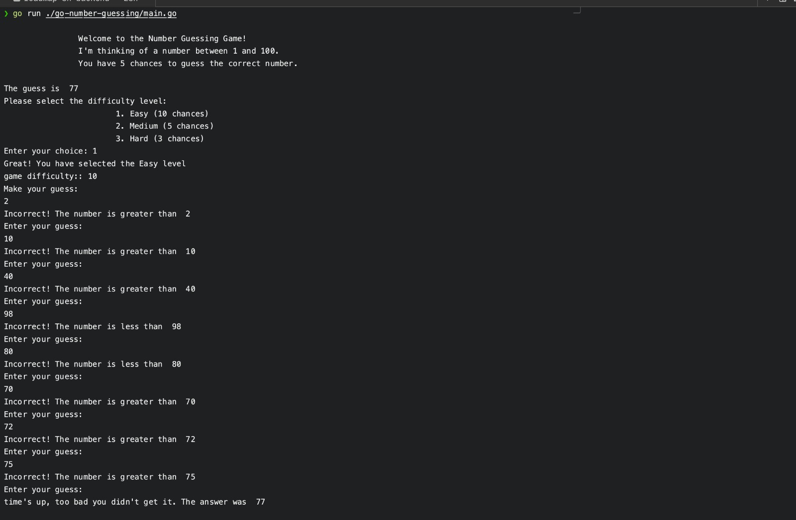

# Number Guessing Game CLI

A simple command-line number guessing game where the computer generates a random number and the user has to guess it. The user selects a difficulty level that determines the number of chances they have to guess correctly. The game also has a time limit, after which it automatically ends. If the user guesses correctly within the time and attempt limits, they win!



## Installation

### Method 1: Using Git and Go

1. Clone the repository:

   ```bash
   git clone https://github.com/Rioba-Ian/roadmap-sh-backend.git
   cd roadmap-sh-backend/go-number-guessing
   ```

2. Build and run the game:
   ```bash
   go build -o guess-game
   ./guess-game
   ```

### Method 2: Using Go Install

If you have Go installed, you can directly install and run the game:

```bash
go install github.com/Rioba-Ian/go-number-guessing@latest
go-number-guessing
```

## Command Line Flags

The game supports several command line flags:

- `--low`: Set the lowest number in the range (default: 1)
- `--high`: Set the highest number in the range (default: 100)
- `--time-limit`: Set the time limit in seconds (default: 15)

Example:

```bash
./guess-game --low=10 --high=50 --time-limit=30
```

## Sample Game Play

```txt
Welcome to the Number Guessing Game!
I'm thinking of a number between 1 and 100.
You have 5 chances to guess the correct number.

Please select the difficulty level:
1. Easy (10 chances)
2. Medium (5 chances)
3. Hard (3 chances)

Enter your choice: 2

Great! You have selected the Medium level
Make your guess:

Enter your guess: 50
Incorrect! Enter your guess:

Enter your guess: 25
Incorrect! Enter your guess:

Enter your guess: 35
Incorrect! Enter your guess:

Enter your guess: 30
You got it right. Kudos!
```

## Features

1. **Difficulty Levels**: Choose between Easy (10 chances), Medium (5 chances), or Hard (3 chances).
2. **Time Limit**: The game has a default time limit of 15 seconds, which can be adjusted using the `--time-limit` flag.
3. **Custom Number Range**: You can customize the range of numbers to guess using the `--low` and `--high` flags.
4. **Attempt Counter**: The game keeps track of the number of attempts made.
5. **Immediate Feedback**: After each guess, you'll receive feedback to help guide your next guess.

## How to Play

1. Start the game using one of the installation methods above.
2. Select a difficulty level (1 for Easy, 2 for Medium, 3 for Hard).
3. Enter your guesses when prompted.
4. Try to guess the correct number within the time limit and allowed number of attempts.
5. If you guess correctly, you win! If you run out of time or attempts, the game will end.

### Acknowledgments

This project is part of the Roadmap.sh backend repository. You can check out the project [here](https://roadmap.sh/projects/number-guessing-game).Special thanks to the contributors who made this project possible.
