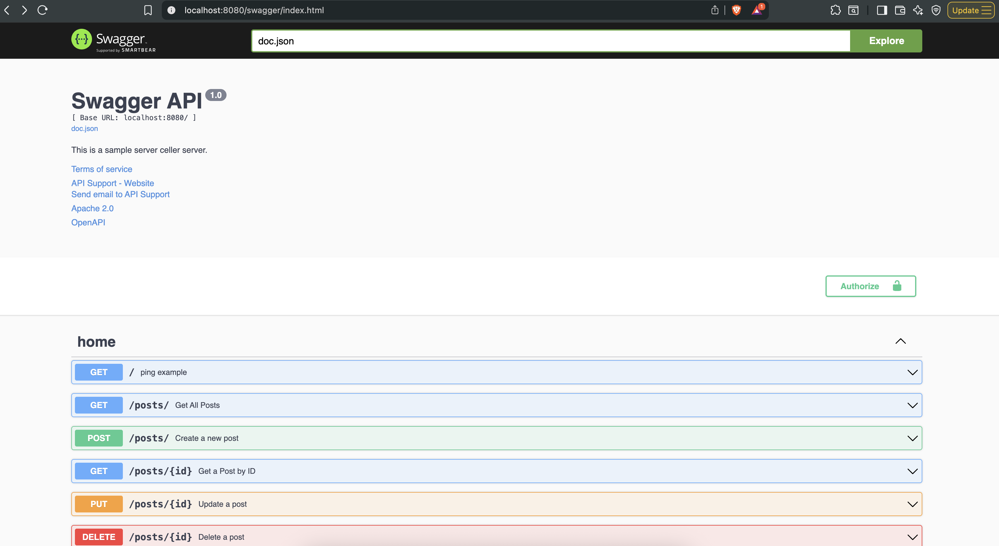

# <code>roadmap.sh</code> backend Projects

## Projects

### Project 1 - Number guessing Game

Number guessing Game.
The game is a simple command-line game where the user has to guess a number between 1 and 100. The game will give hints to the user if the guessed number is too high or too low. The game will also keep track of the number of guesses the user has made.
You can view how to play the game by reading the [Guessing game README.md](https://github.com/Rioba-Ian/roadmap-sh-backend/tree/main/go-number-guessing) file.

The project can be found on [roadmap.sh](https://roadmap.sh/projects/number-guessing-game)

##### Installation

You can install and run the Number Guessing Game using one of these methods:

**Method 1: Using Git and Go**

1. Clone the repository:

   ```bash
   git clone https://github.com/Rioba-Ian/roadmap-sh-backend.git
   cd roadmap-sh-backend/go-number-guessing
   ```

2. Build and run the game:
   ```bash
   go build -o guess-game
   ./guess-game
   ```

**Method 2: Using Go install**

If you have Go installed, you can directly install and run the game:

```bash
go install github.com/Rioba-Ian/go-number-guessing@latest
go-number-guessing
```

**Command Line Flags**

The game supports several command line flags:

- `--low`: Set the lowest number in the range (default: 1)
- `--high`: Set the highest number in the range (default: 100)
- `--time-limit`: Set the time limit in seconds (default: 15)

Example:

```bash
./guess-game --low=10 --high=50 --time-limit=30
```

### Project 2 - Weather API service

Weather API service.
The service is a simple REST API that provides weather information for a given location. The service will use the VisualCrossingWebServices API to fetch weather data. We use a cache to store the weather data for a given location. The key for the cache is the location name. The expiry time is set to 12 hours. The service looks as follows:


#### Installation

You can install and run everything locally but first you need to install Docker and Go.

After installing Docker and Go, you can run the service using the following command:

You can then clone the repository and run the service using the following command:

```bash
git clone https://github.com/Rioba-Ian/roadmap-sh-backend.git
cd roadmap-sh-backend/weather-api-service
go mod download
go mod tidy
```

You can then run the service using the following command:

```bash
docker-compose up
```

The service will be available at http://localhost:8080, you can test it out on the browser or using curl

```bash
curl http://localhost:8080/weather?city=London
```

In the docker container you will see these logs as an example

```bash
weather-api-service-app-1    | The city is: Pretoria, Gauteng, South Africa
weather-api-service-app-1    | cache-miss
weather-api-service-app-1    | cache-hit
```

For a detailed documentation you can visit the projects [README](./weather-api-service/README.md).
The project is attributed to [Roadmapsh backend track](https://roadmap.sh/projects/weather-api-wrapper-service).

### Project 3 - Blogging Platform API

_Blogging Platform API_

The project is attributed to [Roadmapsh backend track](https://roadmap.sh/projects/blogging-platform-api).
You are required to create a simple RESTful API with basic CRUD operations for a personal blogging platform. CRUD stands for Create, Read, Update, and Delete.

Demo



### Goals

- The goals of this project are to help you:

- Understand what the RESTful APIs are including best practices and conventions

- Learn how to create a RESTful API

- Learn about common HTTP methods like GET, POST, PUT, PATCH, DELETE

- Learn about status codes and error handling in APIs

- Learn how to perform CRUD operations using an API

- Learn how to work with databases

##### Running the app

**Prerequisites**

Before you begin, ensure you have the following installed:

- Docker
- Docker Compose

**Installation & Setup**

1. Clone the repository:

   ```bash
   git clone https://github.com/Rioba-Ian/roadmap-sh-backend.git
   cd roadmap-sh-backend/blog-api
   ```

2. Create a `.env.prod` file in the `blog-api` directory with the following environment variables:

   ```bash
   # Database Configuration
   DB_USER=postgres
   DB_PASSWORD=yourpassword
   DB_NAME=blog_db
   DB_HOST=postgres_db
   DB_PORT=5432
   ```

   **Environment Variables Explained:**
   - `DB_USER`: PostgreSQL database user (default: postgres)
   - `DB_PASSWORD`: PostgreSQL database password (set a strong password)
   - `DB_NAME`: Name of the PostgreSQL database
   - `DB_HOST`: Database host address (use `postgres_db` when running via Docker Compose)
   - `DB_PORT`: PostgreSQL port (default: 5432)

3. Run the application with Docker Compose:

   ```bash
   docker-compose up
   ```

   This command will:
   - Build the Go application Docker image
   - Start the PostgreSQL database container
   - Start the blog-api application container
   - Set up networking between the containers

4. The API will be available at `http://localhost:8080`

5. Access the Swagger documentation at `http://localhost:8080/swagger/index.html`

**Testing the API**

You can test the API using curl:

```bash
# Get all posts
curl http://localhost:8080/posts/

# Create a new post
curl -X POST http://localhost:8080/posts/ \
  -H "Content-Type: application/json" \
  -d '{
    "title": "My First Post",
    "content": "This is my first blog post",
    "category": "Technology",
    "tags": ["golang", "api"]
  }'

# Get a specific post (replace {id} with actual post ID)
curl http://localhost:8080/posts/{id}

# Update a post
curl -X PUT http://localhost:8080/posts/{id} \
  -H "Content-Type: application/json" \
  -d '{
    "title": "Updated Title",
    "content": "Updated content",
    "category": "Technology",
    "tags": ["golang", "api", "updated"]
  }'

# Delete a post
curl -X DELETE http://localhost:8080/posts/{id}
```

**Stopping the Application**

To stop the running containers:

```bash
docker-compose down
```

To stop and remove all data (including the database):

```bash
docker-compose down -v
```

**Troubleshooting**

- **Database connection issues**: Ensure the `DB_HOST` is set to `postgres_db` (the service name in docker-compose.yml)
- **Port already in use**: If port 8080 or 5432 is already in use, modify the port mappings in `docker-compose.yml`
- **Database not ready**: The docker-compose file includes a health check. Wait for the database to be healthy before the API starts.

For more information about the project, visit the [Roadmap.sh Backend Track](https://roadmap.sh/projects/blogging-platform-api).
