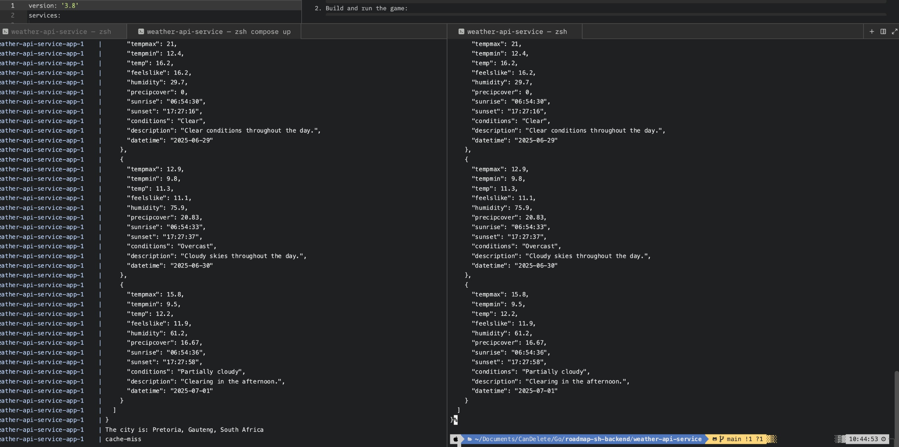

# [roadmap.sh](https://roadmap.sh/projects/weather-api-wrapper-service) Weather API Service

This is a weather API service that provides weather information for a given location. It uses redis for caching weather data. The key for the cache is the location the user provides. And the expiry is set to 12 hours.



## Installation

### Method 1: Using Docker

1. Clone the repository:

   ```bash
   git clone https://github.com/Rioba-Ian/roadmap-sh-backend.git
   cd roadmap-sh-backend/weather-api-service
   ```

2. Build and run the application:
   ```bash
   docker-compose up -d
   ```

Running the api service

```bash
curl http://localhost:8080/weather?city=London
```

### Acknowledgments

This project is part of the Roadmap.sh backend repository. You can check out the project [here](https://roadmap.sh/projects/weather-api-wrapper-service).
